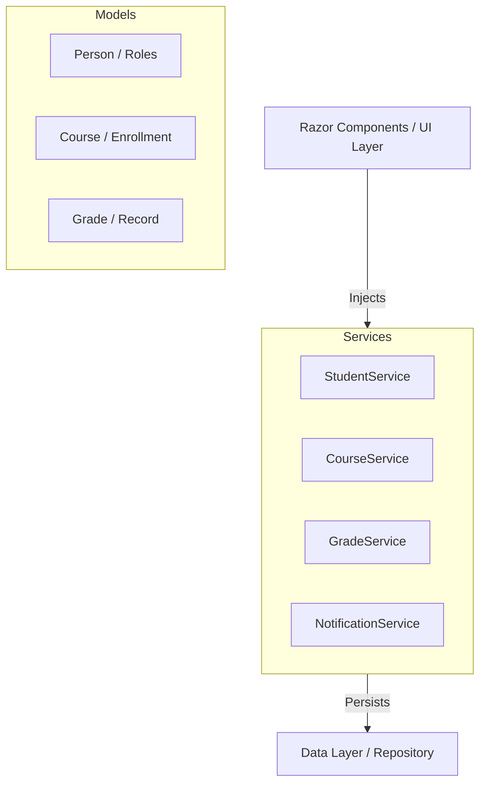

<div align="center">


# 🎓 EduConnect
### *The Ultimate Academic Management Portal*

**A modern Academic Management Portal built with Blazor Server & ASP.NET Core 8**

[](https://dotnet.microsoft.com/)
[](https://blazor.net)
[](https://getbootstrap.com)
[](./SOLID_COMPLIANCE_CHECKLIST.md)

<br />

*Streamlining course management, student enrollment, grade tracking, and institutional communications in one integrated platform.*

[**Explore Features**](#-features) • [**Quick Start**](#-getting-started) • [**Architecture**](#-architecture) • [**API Reference**](#-service-interfaces)

</div>

---

## 📋 Table of Contents

- [🎯 Overview](#-overview)
- [✨ Features](#-features)
- [🛠️ Technology Stack](#️-technology-stack)
- [🏗️ Architecture](#️-architecture)
- [📁 Project Structure](#-project-structure)
- [🚀 Getting Started](#-getting-started)
- [🔑 Default Accounts](#-default-accounts-for-testing)
- [📐 SOLID Principles](#-solid-principles)
- [🔌 Service Interfaces](#-service-interfaces)
- [💾 Data Models](#-data-models)
- [🔐 Role-Based Access](#-role-based-access-control)

---

## 🎯 Overview

**EduConnect** is a comprehensive academic management platform designed for modern educational institutions. It provides a seamless experience for three core user groups — **Students**, **Faculty**, and **Administrators** — each equipped with a tailored dashboard and purpose-built features.

The system is engineered as a **Blazor Interactive Server** application, prioritizing clean architecture, type safety, and strict adherence to **SOLID design principles**.

---

## ✨ Features

### 👤 Authentication & Security
- **Role-Based Access Control (RBAC):** Dedicated permissions for Student, Faculty, and Admin.
- **Secure Sessions:** Robust login system with session state management.
- **Route Guards:** `AuthGuard` implementation protecting sensitive pages.

### 📚 Course Management
- **Lifecycle Management:** Create, update, and archive courses with ease.
- **Dynamic Capacity:** Real-time tracking of course availability (`Open` → `Almost Full` → `Full`).
- **Faculty Allocation:** Assign courses to specific faculty members efficiently.

### 🎓 Student Experience
- **Interactive Enrollment:** Browse catalogs and enroll in courses instantly.
- **Academic Tracking:** Monitor enrolled credit hours and performance metrics.
- **Digital Transcripts:** View full grade history and weighted CGPA.

### 📊 Grade & Performance
- **Automated Grading:** Intelligent mapping from Marks → Letter Grades → GPA Points.
- **CGPA Engine:** Real-time credit-weighted CGPA computation.
- **Faculty Portal:** Streamlined interface for grade submission and review.

### 📢 Real-Time Notifications
- **Event-Driven Alerts:** Instant notifications for enrollment confirmations and grade updates.
- **System Broadcasts:** Admin announcements delivered to all users simultaneously.
- **Interactive Badge:** Notification bell with unread count tracking.

---

## 🛠️ Technology Stack

| Component | Technology |
|---|---|
| **Core Framework** | ASP.NET Core 8.0 |
| **Frontend** | Blazor Interactive Server (C# / Razor) |
| **Styling** | Bootstrap 5.3 + Custom CSS Architecture |
| **Icons** | Bootstrap Icons 1.11 |
| **Typography** | Google Fonts (Outfit & Inter) |
| **Inversion of Control** | Native .NET Dependency Injection |
| **Data Engine** | In-memory Repository Pattern (Seeded) |

---

## 🏗️ Architecture

### High-Level Design



### Event System
EduConnect utilizes a decoupled event-driven architecture to keep the UI synchronized:
- `OnEnrollmentChanged` 🔄 Updates navigation counters.
- `OnGradesSubmitted` 📊 Refreshes transcript views.
- `OnNewNotification` 🔔 Triggers real-time alerts.

---

## 🚀 Getting Started

### 1. Prerequisites
- [.NET 8.0 SDK](https://dotnet.microsoft.com/download)
- Visual Studio 2022 or VS Code (C# Dev Kit)

### 2. Installation & Run
```bash
# Clone the repository
git clone https://github.com/your-username/EduConnect.git

# Navigate to the project folder
cd EduConnect/EduConnect

# Build and run
dotnet run
```

### 3. Access
Open [https://localhost:7000](https://localhost:7000) in your browser.

---

## 🔑 Default Accounts for Testing

| Role | Username | Password |
|---|---|---|
| 🛡️ **Admin** | `admin@educonnect.com` | `admin123` |
| 👨‍🏫 **Faculty** | `faculty@educonnect.com` | `faculty123` |
| 🎓 **Student** | `student@educonnect.com` | `student123` |

---

## 📐 SOLID Principles Implementation

| Principle | Detail |
|---|---|
| **Single Responsibility** | Services like `GradeService` only handle grading logic, not UI or auth. |
| **Open/Closed** | New role types can be added to the hierarchy without modifying existing services. |
| **Liskov Substitution** | `Student` and `Faculty` objects can be used anywhere a `Person` is expected. |
| **Interface Segregation** | Small, focused interfaces (e.g., `IGradeService`) prevent "fat" dependencies. |
| **Dependency Inversion** | High-level components depend on abstractions (`IStudentService`), not concrete implementations. |

---

## 🔌 Service Interfaces

<details>
<summary><b>View Student Service API</b></summary>

```csharp
public interface IStudentService : IRepository<Student>
{
    List<Student> Search(string term);
    double ComputeCGPA(Guid studentId);
}
```
</details>

<details>
<summary><b>View Course Service API</b></summary>

```csharp
public interface ICourseService : IRepository<Course>
{
    List<Course> GetAvailableCourses();
    void EnrollStudent(Guid courseId, Guid studentId);
    event Action OnEnrollmentChanged;
}
```
</details>

---

## 📄 License
This project is developed for **educational purposes**. All rights reserved.
